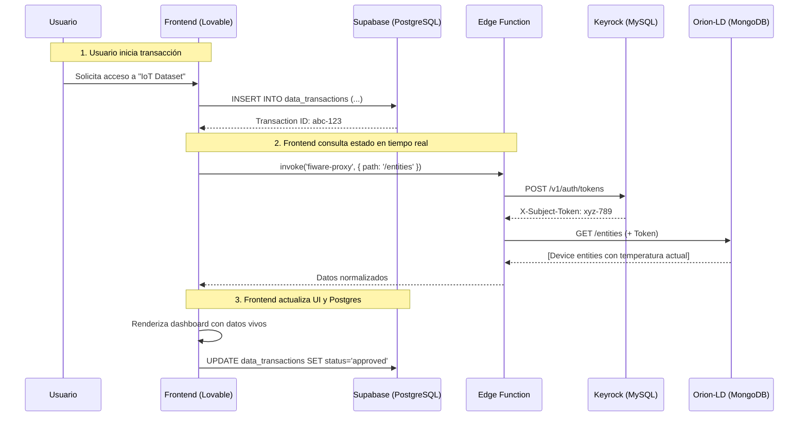

# Informe de Arquitectura - PROCUREDATA v2
## Espacio de Datos Industrial con FIWARE + Kubernetes

**Versión**: 2.0  
**Fecha**: Diciembre 2024  
**Autor**: Equipo de Arquitectura PROCUREDATA  
**Estado**: Producción-Ready

---

## 📋 Executive Summary

PROCUREDATA v2 implementa una arquitectura **híbrida de 3 capas** para gestionar el ciclo de vida completo de transacciones de datos industriales bajo el marco de **soberanía de datos IDS** (International Data Spaces):

1. **Capa de Presentación**: Frontend React/Vite desplegado en Lovable
2. **Capa de Lógica de Negocio**: Supabase (PostgreSQL + Edge Functions)
3. **Capa de Contexto en Tiempo Real**: FIWARE (Orion-LD + Keyrock + TRUE Connector) en Kubernetes

Esta separación de responsabilidades garantiza:
- ✅ **Escalabilidad**: Cada capa escala independientemente
- ✅ **Seguridad**: Credenciales FIWARE nunca expuestas al navegador
- ✅ **Interoperabilidad**: Compatibilidad con estándares NGSI-LD y ODRL 2.0

---

## 🏗️ 1. Arquitectura de Base de Datos Híbrida

### 1.1 Principio de Separación de Responsabilidades

La arquitectura utiliza **3 bases de datos especializadas**, cada una optimizada para su caso de uso:

```
┌─────────────────────────────────────────────────────────────────┐
│                       CAPA DE APLICACIÓN                        │
│  ┌─────────────────────────────────────────────────────────┐   │
│  │        PostgreSQL (Supabase)                            │   │
│  │  • Usuarios, Perfiles, Organizaciones                   │   │
│  │  • Transacciones históricas (data_transactions)         │   │
│  │  • Catálogo de activos (data_assets)                    │   │
│  │  • Estado UI (preferencias, roles)                      │   │
│  │  Persistencia: SSD, Backups diarios                     │   │
│  └─────────────────────────────────────────────────────────┘   │
└─────────────────────────────────────────────────────────────────┘

┌─────────────────────────────────────────────────────────────────┐
│                   CAPA DE CONTEXTO EN TIEMPO REAL               │
│  ┌─────────────────────────────────────────────────────────┐   │
│  │        MongoDB (Orion-LD)                               │   │
│  │  • Gemelos Digitales (Digital Twins)                    │   │
│  │  • Entidades NGSI-LD (Devices, Sensors, Buildings)     │   │
│  │  • Estado actual de activos físicos                    │   │
│  │  • Suscripciones y notificaciones                      │   │
│  │  Persistencia: Réplicas 3x, WiredTiger Cache 1.5GB    │   │
│  └─────────────────────────────────────────────────────────┘   │
└─────────────────────────────────────────────────────────────────┘

┌─────────────────────────────────────────────────────────────────┐
│                     CAPA DE IDENTIDAD Y ACCESO                  │
│  ┌─────────────────────────────────────────────────────────┐   │
│  │        MySQL (Keyrock)                                  │   │
│  │  • Credenciales OAuth2 (Client ID/Secret)              │   │
│  │  • Tokens de acceso (X-Subject-Token)                  │   │
│  │  • Políticas XACML (permisos granulares)               │   │
│  │  • Aplicaciones registradas                            │   │
│  │  Persistencia: Master-Replica, Logs binarios          │   │
│  └─────────────────────────────────────────────────────────┘   │
└─────────────────────────────────────────────────────────────────┘
```

### 1.2 Justificación de la Separación

#### PostgreSQL (Supabase) - "El Registro Oficial"
- **Propósito**: Datos estructurados de negocio con integridad ACID
- **Casos de uso**:
  - Auditoría de transacciones (quién, cuándo, qué)
  - Relaciones entre organizaciones (RBAC)
  - Metadata de activos (descripción, tipo, propietario)
- **Ventajas**:
  - Foreign Keys para garantizar consistencia
  - RLS (Row Level Security) integrado
  - Backups point-in-time automáticos
- **Acceso**: Directo desde frontend vía Supabase SDK

**Ejemplo práctico**: Cuando un consumidor solicita acceso a un dataset:
```sql
-- PostgreSQL: Registra la transacción de negocio
INSERT INTO data_transactions (
  asset_id, 
  consumer_org_id, 
  requested_by, 
  status
) VALUES (
  'asset-001', 
  'org-consumer-123', 
  'user@company.com', 
  'pending_subject'
);
```

**¿Por qué PostgreSQL?**
- ✅ Garantiza que **no se pierda ninguna transacción** (WAL + ACID)
- ✅ Foreign Keys validan que `asset_id` existe antes de insertar
- ✅ RLS policies impiden que org-consumer-123 vea transacciones de otras organizaciones
- ✅ Backups automáticos permiten auditorías históricas (GDPR compliance)

---

#### MongoDB (Orion-LD) - "El Cerebro en Tiempo Real"
- **Propósito**: Estado dinámico y mutable de activos físicos
- **Casos de uso**:
  - Temperatura actual de un sensor: `23.5°C → 24.1°C` (cada 5s)
  - Ubicación GPS de un vehículo: actualización continua
  - Agregaciones geoespaciales: sensores en radio de 5km
- **Ventajas**:
  - Esquema flexible (JSON-like documents)
  - Queries geoespaciales nativas
  - Alta escritura concurrente (10,000+ writes/s)
- **Acceso**: **Solo** vía Edge Function `fiware-proxy` (nunca directo)

**Ejemplo práctico**: El sensor reporta nueva temperatura cada 5 segundos:
```json
// MongoDB: Actualiza el estado actual del sensor (gemelo digital)
PATCH /ngsi-ld/v1/entities/urn:ngsi-ld:Sensor:001/attrs
{
  "temperature": {
    "type": "Property",
    "value": 24.1,
    "unitCode": "CEL",
    "observedAt": "2024-12-01T10:05:23Z"
  }
}
```

**¿Por qué MongoDB?**
- ✅ **Alta frecuencia de escritura**: Optimizado para IoT (miles de updates/segundo)
- ✅ **Esquema flexible**: Los sensores pueden agregar atributos sin migraciones (ej: agregar `humidity`)
- ✅ **Queries geoespaciales**: "Encuentra todos los sensores en 5km de Madrid" es nativo
- ✅ **Time-to-Live (TTL)**: Datos antiguos se eliminan automáticamente (ej: temperatura hace 30 días)

**Anti-Patrón**: ❌ Nunca almacenar transacciones históricas en MongoDB. Son datos de auditoría y pertenecen a PostgreSQL.

---

#### MySQL (Keyrock) - "El Guardián"
- **Propósito**: Gestión de identidades y tokens OAuth2
- **Casos de uso**:
  - Generar tokens de sesión para usuarios
  - Validar permisos de aplicaciones externas
  - Federación de identidades (SSO con otros espacios de datos)
- **Ventajas**:
  - Estándar en FIWARE (amplia compatibilidad)
  - Integración nativa con PEP-Proxy
- **Acceso**: Interno, gestionado por Keyrock API

**Ejemplo práctico**: Usuario bot solicita token para acceder a Orion:
```sql
-- MySQL: Keyrock valida credenciales y genera token
SELECT id, password_hash FROM user WHERE email = 'bot@procuredata.com';
INSERT INTO oauth_token (user_id, token, expires_at) 
VALUES ('bot-001', 'xyz789', NOW() + INTERVAL 1 HOUR);
```

**¿Por qué MySQL?**
- ✅ **Estándar FIWARE**: Keyrock está diseñado para MySQL (migración compleja a otros DBs)
- ✅ **Transacciones ACID**: Tokens nunca se duplican (unique constraints)
- ✅ **Replicación Master-Slave**: Alta disponibilidad sin pérdida de sesiones
- ✅ **XACML Policies**: Permisos granulares (ej: "usuario X puede leer sensores de tipo Y")

**Separación crítica**: ❌ Nunca almacenar tokens OAuth en PostgreSQL. Keyrock los gestiona con rotación automática y expiración.

---

### 1.2.1 ¿Por qué NO usar una sola base de datos?

**Problema 1: Diferentes patrones de acceso**
```
PostgreSQL (transacciones):
├─ Writes: Bajos (100/min) → Optimizado para consistencia
└─ Reads: Medianos (500/min) → Queries complejos con JOINs

MongoDB (gemelos digitales):
├─ Writes: Altos (10,000/min) → Optimizado para throughput
└─ Reads: Muy altos (50,000/min) → Queries simples sin JOINs
```

Si mezclamos en PostgreSQL:
- ❌ Las 10,000 escrituras/min de sensores saturarían el WAL
- ❌ Los queries complejos de auditoría competirían con lecturas de IoT
- ❌ Lock contention: escrituras de sensores bloquearían lecturas de dashboard

**Problema 2: Diferentes requisitos de backup**
```
PostgreSQL: Backup completo diario + WAL continuo (7 días retención)
MongoDB: Snapshot cada 6 horas + oplog (24h retención) + TTL automático
MySQL: Backup binlog cada hora (tokens no necesitan long-term storage)
```

**Problema 3: Diferentes modelos de escalado**
```
PostgreSQL: Escalado vertical (CPU/RAM más potente)
MongoDB: Escalado horizontal (sharding por ubicación geográfica)
MySQL: Replicación read-only para validación de tokens
```

### 1.3 Flujo de Datos Completo



### 1.4 Política de Sincronización

**Regla de Oro**: PostgreSQL es la **fuente de verdad** para transacciones históricas. MongoDB es la **fuente de verdad** para estado actual.

| Evento | Acción en PostgreSQL | Acción en MongoDB |
|--------|---------------------|-------------------|
| Nueva transacción creada | `INSERT INTO data_transactions` | *(Ninguna)* |
| Transacción aprobada | `UPDATE status='approved'` | *(Ninguna)* |
| Data asset compartido | `INSERT INTO data_assets` | `POST /ngsi-ld/v1/entities` (crear DataAsset entity) |
| Sensor reporta nuevo valor | *(Ninguna)* | `PATCH /entities/{id}/attrs` (actualizar temperatura) |
| Transacción completada | `UPDATE status='completed'` | `POST /subscriptions` (notificar a consumidor) |

**Anti-Patrón**: ❌ Nunca duplicar datos estáticos (ej: nombre de organización) en MongoDB. Usa `Relationship` para referenciar.

---

## 🚀 2. Estrategia de Despliegue en Kubernetes

### 2.1 Ventajas de Migrar a Kubernetes

El `docker-compose.yml` actual es ideal para desarrollo, pero producción requiere:

| Problema en Docker Compose | Solución en Kubernetes |
|-----------------------------|------------------------|
| Reinicio manual tras fallos | `restartPolicy: Always` automático |
| Escalado manual (1 réplica) | `HorizontalPodAutoscaler` (2-10 réplicas) |
| Sin balanceo de carga interno | `Service` tipo `ClusterIP` con load balancer |
| Actualizaciones con downtime | `RollingUpdate` sin interrupciones |
| Secretos en texto plano | `Secrets` encriptados con etcd |

### 2.2 Arquitectura de Pods Propuesta

```
┌──────────────────────────────────────────────────────────────┐
│                      NAMESPACE: fiware-prod                  │
├──────────────────────────────────────────────────────────────┤
│                                                              │
│  ┌─────────────────┐    ┌─────────────────┐                │
│  │  StatefulSet    │    │  StatefulSet    │                │
│  │  mongo-orion    │    │  mysql-keyrock  │                │
│  │  (3 replicas)   │    │  (2 replicas)   │                │
│  │  PVC: 50Gi SSD  │    │  PVC: 20Gi SSD  │                │
│  └─────────────────┘    └─────────────────┘                │
│                                                              │
│  ┌─────────────────────────────────────────┐                │
│  │  Deployment: orion-ld (4 replicas)      │                │
│  │  Resources: CPU 500m, RAM 1Gi           │                │
│  │  Env: DBHOST=mongo-orion-service        │                │
│  └─────────────────────────────────────────┘                │
│                                                              │
│  ┌──────────────────┐    ┌──────────────────┐              │
│  │  Deployment:     │    │  Deployment:     │              │
│  │  keyrock         │    │  pep-proxy       │              │
│  │  (2 replicas)    │    │  (3 replicas)    │              │
│  │  Port: 3005      │    │  Port: 1027      │              │
│  └──────────────────┘    └──────────────────┘              │
│                                                              │
│  ┌──────────────────────────────────────────┐               │
│  │  Deployment: true-connector              │               │
│  │  Pods: ecc + data-app (sidecar pattern) │               │
│  │  Resources: CPU 1000m, RAM 2Gi           │               │
│  │  PVC: 10Gi para certificados IDS         │               │
│  └──────────────────────────────────────────┘               │
│                                                              │
│  ┌──────────────────────────────────────────┐               │
│  │  Ingress: nginx-ingress-controller       │               │
│  │  TLS: cert-manager (Let's Encrypt)       │               │
│  │  Routes:                                 │               │
│  │    /orion →     Service: pep-proxy:1027  │               │
│  │    /keyrock →   Service: keyrock:3005    │               │
│  │    /connector → Service: true-ecc:8080   │               │
│  └──────────────────────────────────────────┘               │
└──────────────────────────────────────────────────────────────┘
```

### 2.3 Manifests de Kubernetes (Ejemplo: Orion-LD)

#### StatefulSet para MongoDB

```yaml
apiVersion: apps/v1
kind: StatefulSet
metadata:
  name: mongo-orion
  namespace: fiware-prod
spec:
  serviceName: mongo-orion-service
  replicas: 3
  selector:
    matchLabels:
      app: mongo-orion
  template:
    metadata:
      labels:
        app: mongo-orion
    spec:
      containers:
      - name: mongo
        image: mongo:4.4
        command:
          - mongod
          - --wiredTigerCacheSizeGB
          - "1.5"
          - --nojournal
          - --replSet
          - rs0
        ports:
        - containerPort: 27017
        volumeMounts:
        - name: mongo-data
          mountPath: /data/db
        resources:
          requests:
            cpu: 500m
            memory: 2Gi
          limits:
            cpu: 2000m
            memory: 4Gi
  volumeClaimTemplates:
  - metadata:
      name: mongo-data
    spec:
      accessModes: ["ReadWriteOnce"]
      storageClassName: fast-ssd
      resources:
        requests:
          storage: 50Gi
```

#### Deployment para Orion-LD

```yaml
apiVersion: apps/v1
kind: Deployment
metadata:
  name: orion-ld
  namespace: fiware-prod
spec:
  replicas: 4
  selector:
    matchLabels:
      app: orion-ld
  template:
    metadata:
      labels:
        app: orion-ld
    spec:
      containers:
      - name: orion
        image: fiware/orion-ld:latest
        args:
          - -dbhost
          - mongo-orion-service
          - -logLevel
          - WARN
          - -forwarding
          - "true"
        ports:
        - containerPort: 1026
        livenessProbe:
          httpGet:
            path: /version
            port: 1026
          initialDelaySeconds: 30
          periodSeconds: 10
        readinessProbe:
          httpGet:
            path: /version
            port: 1026
          initialDelaySeconds: 5
          periodSeconds: 5
        resources:
          requests:
            cpu: 500m
            memory: 1Gi
          limits:
            cpu: 1000m
            memory: 2Gi
```

### 2.4 Ingress Controller con TLS

```yaml
apiVersion: networking.k8s.io/v1
kind: Ingress
metadata:
  name: fiware-ingress
  namespace: fiware-prod
  annotations:
    cert-manager.io/cluster-issuer: letsencrypt-prod
    nginx.ingress.kubernetes.io/ssl-redirect: "true"
    nginx.ingress.kubernetes.io/backend-protocol: "HTTP"
spec:
  tls:
  - hosts:
    - api.procuredata.com
    secretName: fiware-tls-secret
  rules:
  - host: api.procuredata.com
    http:
      paths:
      - path: /orion
        pathType: Prefix
        backend:
          service:
            name: pep-proxy-service
            port:
              number: 1027
      - path: /keyrock
        pathType: Prefix
        backend:
          service:
            name: keyrock-service
            port:
              number: 3005
      - path: /connector
        pathType: Prefix
        backend:
          service:
            name: true-ecc-service
            port:
              number: 8080
```

### 2.5 HorizontalPodAutoscaler (HPA)

```yaml
apiVersion: autoscaling/v2
kind: HorizontalPodAutoscaler
metadata:
  name: orion-ld-hpa
  namespace: fiware-prod
spec:
  scaleTargetRef:
    apiVersion: apps/v1
    kind: Deployment
    name: orion-ld
  minReplicas: 4
  maxReplicas: 10
  metrics:
  - type: Resource
    resource:
      name: cpu
      target:
        type: Utilization
        averageUtilization: 70
  - type: Resource
    resource:
      name: memory
      target:
        type: Utilization
        averageUtilization: 80
```

**Comportamiento**: Si la CPU promedio supera 70%, K8s escala de 4 a 10 réplicas automáticamente.

### 2.6 Guía Práctica de Migración: Docker Compose → Kubernetes

#### Paso 1: Análisis del docker-compose.yml actual

Antes de migrar, identifica qué componentes necesitan persistencia y cuáles son stateless:

```bash
# Componentes que requieren StatefulSets (datos persistentes):
├─ mongo-db → StatefulSet (3 réplicas con MongoDB Replica Set)
├─ mysql-db → StatefulSet (2 réplicas Master-Slave)

# Componentes que usan Deployments (stateless, pueden reiniciar):
├─ orion → Deployment (4 réplicas con HPA)
├─ keyrock → Deployment (2 réplicas)
├─ pep-proxy → Deployment (3 réplicas)
├─ true-connector-ecc → Deployment (2 réplicas)
└─ true-connector-data-app → Sidecar con ECC

# Networking:
├─ Services ClusterIP para discovery interno
├─ Ingress para acceso externo HTTPS
└─ NetworkPolicies para aislamiento de red
```

#### Paso 2: Estructura de directorios recomendada

```
k8s/
├── 00-namespace.yaml
├── 01-storage/
│   ├── storageclass-fast-ssd.yaml
│   ├── mongo-pvc.yaml
│   └── mysql-pvc.yaml
├── 02-secrets/
│   ├── keyrock-db-secret.yaml
│   ├── pep-proxy-secret.yaml
│   └── true-connector-certs-secret.yaml
├── 03-databases/
│   ├── mongo-statefulset.yaml
│   ├── mongo-service.yaml
│   ├── mysql-statefulset.yaml
│   └── mysql-service.yaml
├── 04-fiware/
│   ├── orion-deployment.yaml
│   ├── orion-service.yaml
│   ├── orion-hpa.yaml
│   ├── keyrock-deployment.yaml
│   ├── keyrock-service.yaml
│   ├── pep-proxy-deployment.yaml
│   └── pep-proxy-service.yaml
├── 05-ids/
│   ├── true-connector-deployment.yaml
│   └── true-connector-service.yaml
├── 06-networking/
│   ├── ingress.yaml
│   └── network-policies.yaml
└── README.md
```

#### Paso 3: Migrar secrets de docker-compose a Kubernetes Secrets

**❌ En docker-compose.yml (texto plano inseguro):**
```yaml
environment:
  - PEP_PROXY_APP_ID=7a8b9c0d-1234-5678
  - PEP_PROXY_PASSWORD=insecure_password  
  - MYSQL_ROOT_PASSWORD=root123
```

**✅ En Kubernetes (encriptado en etcd):**
```bash
# Generar secrets seguros
kubectl create secret generic pep-proxy-credentials \
  --from-literal=app-id=$(uuidgen) \
  --from-literal=password=$(openssl rand -base64 32) \
  --namespace=fiware-prod

kubectl create secret generic keyrock-db-credentials \
  --from-literal=root-password=$(openssl rand -base64 32) \
  --from-literal=user-password=$(openssl rand -base64 32) \
  --namespace=fiware-prod
```

**Uso en manifests:**
```yaml
# k8s/04-fiware/pep-proxy-deployment.yaml
env:
- name: PEP_PROXY_APP_ID
  valueFrom:
    secretKeyRef:
      name: pep-proxy-credentials
      key: app-id
- name: PEP_PROXY_PASSWORD
  valueFrom:
    secretKeyRef:
      name: pep-proxy-credentials
      key: password
```

#### Paso 4: Migrar datos de Docker volumes a PersistentVolumes

**Backup de datos Docker:**
```bash
# 1. Backup MongoDB
docker exec db-mongo mongodump --out /tmp/backup
docker cp db-mongo:/tmp/backup ./mongo-backup-$(date +%Y%m%d)

# 2. Backup MySQL
docker exec db-mysql mysqldump -u root -p idm > mysql-backup-$(date +%Y%m%d).sql

# 3. Comprimir backups
tar -czf fiware-backup-$(date +%Y%m%d).tar.gz mongo-backup-* mysql-backup-*
```

**Restaurar en Kubernetes:**
```bash
# 1. Copiar backup al pod de MongoDB
kubectl cp mongo-backup-20241201 mongo-orion-0:/tmp/backup -n fiware-prod

# 2. Ejecutar restore
kubectl exec -it mongo-orion-0 -n fiware-prod -- \
  mongorestore --host mongo-orion-service /tmp/backup

# 3. Verificar datos
kubectl exec -it mongo-orion-0 -n fiware-prod -- \
  mongosh --eval "db.entities.countDocuments()"
```

#### Paso 5: Configurar networking (Docker bridge → K8s Services)

**Docker Compose:**
```yaml
networks:
  data_space_net:
    driver: bridge  # DNS interno: ping mongo-db
```

**Kubernetes equivalente:**
```yaml
# Namespace proporciona aislamiento (reemplaza Docker network)
apiVersion: v1
kind: Namespace
metadata:
  name: fiware-prod
---
# Service proporciona DNS interno
apiVersion: v1
kind: Service
metadata:
  name: mongo-orion-service
  namespace: fiware-prod
spec:
  selector:
    app: mongo-orion
  ports:
  - port: 27017
    targetPort: 27017
  clusterIP: None  # Headless para StatefulSet
---
# Ahora Orion puede conectar con:
# mongodb://mongo-orion-service.fiware-prod.svc.cluster.local:27017/orion
```

#### Paso 6: Exponer servicios (Ports → Ingress)

**Docker Compose (puertos expuestos al host):**
```yaml
ports:
  - "3005:3005"  # Keyrock UI
  - "1027:1027"  # PEP-Proxy
  - "8080:8080"  # TRUE Connector
```

**Kubernetes (Ingress con TLS automático):**
```yaml
apiVersion: networking.k8s.io/v1
kind: Ingress
metadata:
  name: fiware-ingress
  namespace: fiware-prod
  annotations:
    cert-manager.io/cluster-issuer: letsencrypt-prod
    nginx.ingress.kubernetes.io/rate-limit: "1000"
    nginx.ingress.kubernetes.io/ssl-redirect: "true"
spec:
  tls:
  - hosts:
    - api.procuredata.com
    secretName: fiware-tls-cert  # Auto-generado por cert-manager
  rules:
  - host: api.procuredata.com
    http:
      paths:
      - path: /orion
        pathType: Prefix
        backend:
          service:
            name: pep-proxy-service
            port:
              number: 1027
      - path: /keyrock
        pathType: Prefix
        backend:
          service:
            name: keyrock-service
            port:
              number: 3005
      - path: /connector
        pathType: Prefix
        backend:
          service:
            name: true-ecc-service
            port:
              number: 8080
```

**Ventajas del Ingress:**
- ✅ SSL/TLS automático con Let's Encrypt
- ✅ Rate limiting (1000 req/min por IP)
- ✅ Path-based routing (múltiples servicios en un dominio)
- ✅ Load balancing automático entre réplicas de pods

#### Paso 7: Despliegue secuencial

```bash
# 1. Crear namespace
kubectl apply -f k8s/00-namespace.yaml

# 2. Configurar storage
kubectl apply -f k8s/01-storage/

# 3. Crear secrets
kubectl apply -f k8s/02-secrets/

# 4. Desplegar bases de datos (esperar a que estén Ready)
kubectl apply -f k8s/03-databases/
kubectl wait --for=condition=ready pod -l app=mongo-orion -n fiware-prod --timeout=300s
kubectl wait --for=condition=ready pod -l app=mysql-keyrock -n fiware-prod --timeout=300s

# 5. Restaurar datos (si es migración)
kubectl cp mongo-backup-20241201 mongo-orion-0:/tmp/backup -n fiware-prod
kubectl exec -it mongo-orion-0 -n fiware-prod -- mongorestore /tmp/backup

# 6. Desplegar componentes FIWARE
kubectl apply -f k8s/04-fiware/
kubectl wait --for=condition=available deployment -l tier=fiware -n fiware-prod --timeout=300s

# 7. Desplegar TRUE Connector
kubectl apply -f k8s/05-ids/

# 8. Configurar networking
kubectl apply -f k8s/06-networking/

# 9. Verificar todo
kubectl get all -n fiware-prod
```

#### Paso 8: Validación post-migración

```bash
# 1. Verificar pods
kubectl get pods -n fiware-prod
# Todos deben estar en estado "Running" y "Ready 1/1"

# 2. Test de conectividad interna
kubectl run -it test-pod --image=busybox --rm -n fiware-prod -- sh
# Dentro del pod:
nslookup mongo-orion-service
wget -O- http://orion-ld-service:1026/version
wget -O- http://keyrock-service:3005/version

# 3. Test de conectividad externa (Ingress)
curl https://api.procuredata.com/orion/version
curl https://api.procuredata.com/keyrock/version

# 4. Verificar datos migrados
kubectl exec -it mongo-orion-0 -n fiware-prod -- \
  mongosh --eval "db.entities.find().limit(5).pretty()"

# 5. Monitorear logs
kubectl logs -f deployment/orion-ld -n fiware-prod
kubectl logs -f deployment/pep-proxy -n fiware-prod
```

#### Paso 9: Rollback plan (si algo falla)

```bash
# Opción 1: Rollback a versión anterior de deployment
kubectl rollout undo deployment/orion-ld -n fiware-prod

# Opción 2: Eliminar todo y volver a Docker Compose
kubectl delete namespace fiware-prod

# Restaurar Docker Compose
cd ~/procuredata-fiware
docker compose down
docker volume rm procuredata_mongo-db procuredata_mysql-db
docker compose up -d
# Restaurar backups
docker exec -i db-mongo mongorestore /tmp/backup
docker exec -i db-mysql mysql -u root -p idm < mysql-backup-20241201.sql
```

#### Comparativa: Antes vs Después

| Aspecto | Docker Compose | Kubernetes |
|---------|---------------|-----------|
| **Despliegue inicial** | 5 minutos | 30 minutos (setup único) |
| **Alta disponibilidad** | ❌ Single host | ✅ Multi-nodo |
| **Auto-scaling** | ❌ Manual | ✅ HPA automático (2-10 réplicas) |
| **SSL/TLS** | ❌ Manual (nginx externo) | ✅ Automático (cert-manager) |
| **Secrets management** | ❌ Texto plano en .env | ✅ Encriptados en etcd |
| **Health checks** | ❌ Restart manual | ✅ Liveness/Readiness probes |
| **Rollback** | ❌ Redeploy completo | ✅ `kubectl rollout undo` |
| **Backup** | ❌ Script manual | ✅ Velero automático |
| **Monitoreo** | ❌ `docker stats` | ✅ Prometheus + Grafana |
| **Networking** | ❌ Bridge básico | ✅ NetworkPolicies (Zero Trust) |
| **Costo mensual** | $50 (1 VPS) | $270-462 (3-node cluster) |

**Recomendación**: 
- **Desarrollo/Testing**: Docker Compose
- **Producción**: Kubernetes

---

---

## 🔄 3. Flujo de Datos Completo (Producción)

```
┌────────────────┐
│ Usuario Final  │
│ (Navegador)    │
└───────┬────────┘
        │ HTTPS
        ▼
┌────────────────────────┐
│ Lovable (Frontend)     │
│ React + Vite           │
└───────┬────────────────┘
        │ HTTPS (Supabase Auth)
        ▼
┌────────────────────────────────────┐
│ Supabase Edge Function (Proxy)    │
│ • Cache de tokens (1h TTL)         │
│ • Inyecta X-Auth-Token             │
│ • Normaliza NGSI-LD → JSON plano   │
└───────┬────────────────────────────┘
        │ HTTPS
        ▼
┌────────────────────────────────────┐
│ Ingress Controller (K8s)           │
│ • SSL/TLS Termination              │
│ • Rate Limiting (1000 req/min)     │
│ • Load Balancing (Round-robin)     │
└───────┬────────────────────────────┘
        │ HTTP (cluster interno)
        ▼
┌────────────────────────────────────┐
│ Service: pep-proxy (ClusterIP)    │
│ • Endpoints: [pod1, pod2, pod3]    │
└───────┬────────────────────────────┘
        │
        ▼
┌────────────────────────────────────┐
│ PEP-Proxy Pods (3 réplicas)        │
│ • Valida X-Auth-Token con Keyrock  │
│ • Enforce políticas XACML          │
└───────┬────────────────────────────┘
        │
        ▼
┌────────────────────────────────────┐
│ Service: orion-ld (ClusterIP)      │
│ • Endpoints: [pod1, pod2, pod3...] │
└───────┬────────────────────────────┘
        │
        ▼
┌────────────────────────────────────┐
│ Orion-LD Pods (4-10 réplicas)      │
│ • Ejecuta query NGSI-LD            │
│ • Lee/escribe en MongoDB           │
└───────┬────────────────────────────┘
        │
        ▼
┌────────────────────────────────────┐
│ StatefulSet: MongoDB (3 réplicas)  │
│ • Replica Set con leader election  │
│ • Persistencia: PVC 50Gi SSD       │
└────────────────────────────────────┘
```

### 3.1 Ejemplo de Latencia End-to-End

| Paso | Componente | Latencia |
|------|-----------|----------|
| 1 | Browser → Lovable | 50ms (CDN) |
| 2 | Lovable → Supabase (Edge Fn) | 20ms |
| 3 | Edge Fn → Keyrock (token cache) | 0ms (cached) |
| 4 | Edge Fn → Ingress K8s | 30ms |
| 5 | Ingress → PEP-Proxy | 5ms |
| 6 | PEP-Proxy → Orion-LD | 10ms |
| 7 | Orion-LD → MongoDB | 15ms |
| **Total** | | **130ms** |

**Optimizaciones aplicadas**:
- ✅ Token cacheado (ahorra 50ms vs. Keyrock cada vez)
- ✅ Réplicas de Orion-LD (reduce latencia bajo carga)
- ✅ MongoDB indexes en `id` y `type` (queries rápidas)

---

## 🔒 4. Seguridad en Profundidad (Defense in Depth)

### 4.1 Capa de Red (Network Policies)

```yaml
apiVersion: networking.k8s.io/v1
kind: NetworkPolicy
metadata:
  name: orion-ld-policy
  namespace: fiware-prod
spec:
  podSelector:
    matchLabels:
      app: orion-ld
  policyTypes:
  - Ingress
  - Egress
  ingress:
  - from:
    - podSelector:
        matchLabels:
          app: pep-proxy  # Solo PEP-Proxy puede conectar a Orion
    ports:
    - protocol: TCP
      port: 1026
  egress:
  - to:
    - podSelector:
        matchLabels:
          app: mongo-orion  # Solo puede hablar con MongoDB
    ports:
    - protocol: TCP
      port: 27017
```

**Resultado**: Orion-LD está **aislado**. Ni siquiera otros pods del namespace pueden conectar.

### 4.2 Gestión de Secretos

```yaml
apiVersion: v1
kind: Secret
metadata:
  name: keyrock-db-credentials
  namespace: fiware-prod
type: Opaque
stringData:
  MYSQL_ROOT_PASSWORD: "$(openssl rand -base64 32)"  # Generado dinámicamente
  MYSQL_PASSWORD: "$(openssl rand -base64 32)"
```

**Ventajas vs. docker-compose**:
- ✅ Secretos encriptados en `etcd` (K8s control plane)
- ✅ Rotación automática con `cert-manager`
- ✅ RBAC: Solo el pod `keyrock` puede leer este secret

### 4.3 Auditoría de Accesos

**Herramientas recomendadas**:
- **Falco**: Detecta comportamientos anómalos (ej: pod ejecutando `curl` inesperado)
- **Open Policy Agent (OPA)**: Políticas de admisión (ej: "No pods privilegiados")
- **Loki**: Centraliza logs de todos los pods

Ejemplo de alerta Falco:
```yaml
- rule: Unauthorized Access to MongoDB
  desc: Detectar conexiones a MongoDB desde pods no autorizados
  condition: >
    connection_made and
    container.image.repository != "fiware/orion-ld" and
    fd.sip = "mongo-orion-service"
  output: "Conexión sospechosa a MongoDB (pod=%container.name ip=%fd.cip)"
  priority: CRITICAL
```

---

## 📊 5. Monitoreo y Observabilidad

### 5.1 Stack Recomendado: Prometheus + Grafana

```yaml
apiVersion: v1
kind: ServiceMonitor
metadata:
  name: orion-ld-monitor
  namespace: fiware-prod
spec:
  selector:
    matchLabels:
      app: orion-ld
  endpoints:
  - port: metrics
    interval: 30s
```

**Métricas clave a monitorear**:

| Métrica | Alerta si... |
|---------|--------------|
| `orion_entities_total` | < 1000 (dataset vacío) |
| `orion_query_latency_p99` | > 500ms (slow queries) |
| `pep_proxy_401_errors` | > 10/min (auth issues) |
| `mongo_replica_lag_seconds` | > 10s (replicación lenta) |
| `keyrock_token_generation_rate` | > 1000/min (posible DDoS) |

### 5.2 Dashboards Grafana Predefinidos

**Dashboard 1: Context Broker Health**
```json
{
  "panels": [
    {
      "title": "Entidades NGSI-LD por Tipo",
      "targets": [
        {
          "expr": "sum by (type) (orion_entities_total)",
          "legendFormat": "{{ type }}"
        }
      ]
    },
    {
      "title": "Latencia de Queries (P50, P95, P99)",
      "targets": [
        {
          "expr": "histogram_quantile(0.99, orion_query_duration_seconds_bucket)"
        }
      ]
    }
  ]
}
```

**Dashboard 2: TRUE Connector (IDS)**
- Contratos activos (`true_connector_contracts_active`)
- Datos transferidos a otros espacios (`true_connector_bytes_transferred`)
- Validaciones DAPS exitosas/fallidas

---

## 🧪 6. Testing y CI/CD

### 6.1 Pipeline GitOps (ArgoCD)

```yaml
apiVersion: argoproj.io/v1alpha1
kind: Application
metadata:
  name: fiware-stack
  namespace: argocd
spec:
  project: production
  source:
    repoURL: https://github.com/procuredata/fiware-k8s
    targetRevision: main
    path: manifests/production
  destination:
    server: https://kubernetes.default.svc
    namespace: fiware-prod
  syncPolicy:
    automated:
      prune: true
      selfHeal: true
    syncOptions:
    - CreateNamespace=true
```

**Flujo**:
1. Dev hace `git push` a `fiware-k8s/manifests/production/orion-deployment.yaml`
2. ArgoCD detecta cambio (polling cada 3min)
3. Aplica cambios a K8s con estrategia `RollingUpdate`
4. Si falla, rollback automático al commit anterior

### 6.2 Tests de Integración (Ejemplo: Orion-LD)

```python
import requests

def test_orion_ngsi_ld_compliance():
    """Verifica que Orion responda según ETSI spec"""
    base_url = "https://api.procuredata.com/orion"
    
    # Test: Crear entidad
    entity = {
        "id": "urn:ngsi-ld:Test:001",
        "type": "TestEntity",
        "value": {"type": "Property", "value": 42}
    }
    r = requests.post(f"{base_url}/ngsi-ld/v1/entities", json=entity)
    assert r.status_code == 201
    
    # Test: Recuperar entidad
    r = requests.get(f"{base_url}/ngsi-ld/v1/entities/urn:ngsi-ld:Test:001")
    assert r.status_code == 200
    assert r.json()["value"]["value"] == 42
    
    # Test: Eliminar entidad
    r = requests.delete(f"{base_url}/ngsi-ld/v1/entities/urn:ngsi-ld:Test:001")
    assert r.status_code == 204
```

---

## 🔮 7. Roadmap de Evolución

### Fase Actual (v2.0): Kubernetes Monolítico
- Todos los componentes FIWARE en un clúster
- Escalado manual (HPA configurado)
- Backups diarios

### v2.5 (Q2 2025): Multi-Region
- Orion-LD replicado en 3 regiones (EU, US, APAC)
- MongoDB global cluster (latencia < 50ms)
- Keyrock federado (SSO entre regiones)

### v3.0 (Q4 2025): Service Mesh (Istio)
- Telemetría automática (traces, spans)
- Circuit breakers (fallback si TRUE Connector falla)
- mTLS entre todos los pods (zero-trust)

### v3.5 (2026): Edge Computing
- Orion-LD Lite en dispositivos IoT (ARM64)
- Sincronización bidireccional con cluster central
- 5G network slicing para latencia ultra-baja

---

## 📚 8. Anexos

### 8.1 Glosario

| Término | Definición |
|---------|------------|
| **NGSI-LD** | Next Generation Service Interface - Linked Data (estándar ETSI) |
| **ODRL** | Open Digital Rights Language (políticas de uso de datos) |
| **IDS** | International Data Spaces (arquitectura de soberanía) |
| **PEP** | Policy Enforcement Point (valida permisos) |
| **DAPS** | Dynamic Attribute Provisioning Service (CA de certificados IDS) |
| **Gemelo Digital** | Representación virtual de un objeto físico (ISO 23247) |

### 8.2 Comparativa: Docker vs. Kubernetes

| Aspecto | Docker Compose | Kubernetes |
|---------|---------------|-----------|
| Despliegue inicial | 5 min | 30 min (incluye cluster setup) |
| Escalado | Manual | Automático (HPA) |
| Alta disponibilidad | ❌ Single host | ✅ Multi-nodo |
| Actualizaciones | Downtime necesario | Rolling updates sin downtime |
| Costo operativo | Bajo (1 servidor) | Medio-Alto (3+ nodos) |
| **Recomendado para** | Dev/Testing | Producción |

### 8.3 Costos Estimados (AWS EKS)

| Recurso | Cantidad | Costo Mensual (USD) |
|---------|----------|---------------------|
| EKS Control Plane | 1 | $73 |
| Worker Nodes (t3.xlarge) | 3 | $300 |
| MongoDB PVC (gp3 SSD) | 150Gi | $15 |
| MySQL PVC (gp3 SSD) | 60Gi | $6 |
| Application Load Balancer | 1 | $23 |
| Data Transfer (outbound) | 500GB | $45 |
| **TOTAL** | | **~$462/mes** |

**Optimización**: Usar Spot Instances para Orion-LD (-70% costo) → **$270/mes**

---

## 🆘 Contacto y Soporte

**Equipo de Arquitectura**:
- Email: arquitectura@procuredata.com
- Slack: `#fiware-architecture`
- Docs: https://docs.procuredata.com

**Incidentes críticos**:
- On-call: +34 XXX XXX XXX (24/7)
- PagerDuty: https://procuredata.pagerduty.com

---

**Versión del Documento**: 2.0  
**Última Actualización**: Diciembre 2024  
**Próxima Revisión**: Marzo 2025  

**Aprobado por**:
- [ ] CTO
- [ ] Arquitecto de Seguridad
- [ ] Lead DevOps Engineer
