# Manual del Desarrollador - PROCUREDATA v2

## 🎯 Objetivo
Este documento es tu referencia técnica para desarrollar funcionalidades que consuman datos en tiempo real del **Espacio de Datos Industrial** basado en FIWARE, sin comprometer la seguridad ni exponer el backend.

---

## 🏗️ 1. Arquitectura de Conexión: El Patrón Proxy

### ⚠️ Regla de Oro: **NUNCA** hacer `fetch` directo a FIWARE

```typescript
// ❌ INCORRECTO - Esto causará errores CORS y expondrá credenciales
const response = await fetch('http://orion:1026/ngsi-ld/v1/entities');
const response = await fetch('http://tu-servidor:1027/ngsi-ld/v1/entities');

// ✅ CORRECTO - Usa el proxy seguro de Supabase Edge Function
const { data } = await supabase.functions.invoke('fiware-proxy', {
  body: { 
    path: '/ngsi-ld/v1/entities', 
    method: 'GET' 
  }
});
```

**Firma de la Edge Function `fiware-proxy`:**

```typescript
interface ProxyRequest {
  path: string;        // Ruta relativa (ej: '/ngsi-ld/v1/entities')
  method: string;      // GET, POST, PUT, DELETE, PATCH
  body?: object;       // Payload para POST/PUT/PATCH (opcional)
  skipAuth?: boolean;  // true para endpoints públicos como /version
}
```

### ¿Por qué el Proxy es Obligatorio?

1. **Seguridad de Credenciales**: El proxy inyecta el `X-Auth-Token` de Keyrock automáticamente. El frontend NUNCA conoce estas credenciales.
2. **CORS**: FIWARE no tiene CORS habilitado. El proxy (Supabase Edge Function) sí.
3. **Mixed Content**: Tu UI está en HTTPS (Lovable). FIWARE interno está en HTTP. El navegador bloquearía la conexión.
4. **Multi-Tenancy**: El proxy añade el header `NGSILD-Tenant: procuredata` para separar tus datos de otros espacios.

### Flujo de Autenticación (Transparente para ti)

El frontend **nunca maneja credenciales de FIWARE directamente**. La autenticación funciona así:

1. **Frontend**: El usuario inicia sesión en la aplicación usando Supabase Auth (email/password).
2. **Proxy (Edge Function)**: Cuando haces `supabase.functions.invoke('fiware-proxy')`, el proxy:
   - Usa las credenciales almacenadas en secrets (`FIWARE_USER`, `FIWARE_PASS`)
   - Obtiene un token OAuth2 de **Keyrock** (Identity Manager)
   - Inyecta el `X-Auth-Token` en cada petición a Orion-LD/TRUE Connector
3. **FIWARE Backend**: Valida el token antes de procesar la petición

```mermaid
sequenceDiagram
    participant U as Usuario
    participant F as Frontend (React)
    participant S as Supabase Auth
    participant P as Edge Function (Proxy)
    participant K as Keyrock (IDM)
    participant O as Orion-LD
    
    U->>F: Login (email/password)
    F->>S: Autenticación Supabase
    S-->>F: Sesión válida
    
    F->>P: invoke('fiware-proxy', {path, method, body})
    P->>K: POST /v1/auth/tokens (FIWARE_USER/PASS)
    K-->>P: X-Subject-Token (OAuth2)
    P->>O: GET /entities + X-Auth-Token
    O-->>P: JSON-LD Entities
    P-->>F: Datos normalizados
```



**Importante**: 
- El token OAuth2 de Keyrock se cachea por **1 hora** en el proxy
- **Tú NO necesitas** manejar renovación de tokens
- El frontend solo necesita una sesión válida de Supabase

---

## 📡 2. Catálogo de Endpoints (Middleware)

### 2.1 Firma de la Edge Function `fiware-proxy`

```typescript
interface ProxyRequest {
  path: string;        // Ruta relativa (ej: '/ngsi-ld/v1/entities')
  method?: string;     // GET, POST, PUT, DELETE, PATCH
  body?: any;          // Payload para POST/PUT/PATCH
  skipAuth?: boolean;  // true para endpoints públicos (ej: /version)
}

interface ProxyResponse {
  success: boolean;
  data?: any;
  error?: string;
  status: 'connected' | 'standby' | 'error';
}
```

### 2.2 Ejemplos de Uso

#### Consultar todas las entidades

```typescript
import { supabase } from '@/integrations/supabase/client';

const getEntities = async () => {
  const { data, error } = await supabase.functions.invoke('fiware-proxy', {
    body: {
      path: '/ngsi-ld/v1/entities?type=Device&limit=100',
      method: 'GET'
    }
  });

  if (error) {
    console.error('Error:', error);
    return [];
  }

  return data.success ? data.data : [];
};
```

#### Crear una nueva entidad

```typescript
const createDevice = async (deviceData: any) => {
  const entity = {
    id: 'urn:ngsi-ld:Device:sensor001',
    type: 'Device',
    name: {
      type: 'Property',
      value: deviceData.name
    },
    location: {
      type: 'GeoProperty',
      value: {
        type: 'Point',
        coordinates: [deviceData.longitude, deviceData.latitude] // [long, lat]
      }
    },
    '@context': [
      'https://uri.etsi.org/ngsi-ld/v1/ngsi-ld-core-context.jsonld',
      'https://smartdatamodels.org/context.jsonld'
    ]
  };

  const { data, error } = await supabase.functions.invoke('fiware-proxy', {
    body: {
      path: '/ngsi-ld/v1/entities',
      method: 'POST',
      body: entity
    }
  });

  return data;
};
```

#### Actualizar atributos de una entidad

```typescript
const updateTemperature = async (deviceId: string, temp: number) => {
  const { data } = await supabase.functions.invoke('fiware-proxy', {
    body: {
      path: `/ngsi-ld/v1/entities/${deviceId}/attrs`,
      method: 'PATCH',
      body: {
        temperature: {
          type: 'Property',
          value: temp,
          unitCode: 'CEL',
          observedAt: new Date().toISOString()
        }
      }
    }
  });

  return data;
};
```

---

## 🧩 3. Guía de Componentes FIWARE

### 3.1 Orion-LD Context Broker

**¿Qué es?** El "cerebro" del espacio de datos. Almacena **gemelos digitales** (Digital Twins) de activos físicos.

#### Estructura NGSI-LD

Cada entidad tiene:
- **id**: URN único (ej: `urn:ngsi-ld:Device:001`)
- **type**: Tipo semántico (ej: `Device`, `Building`, `Vehicle`)
- **@context**: Vocabulario compartido (Smart Data Models)
- **Propiedades**: `{ type: 'Property', value: ... }`
- **Relaciones**: `{ type: 'Relationship', object: 'urn:ngsi-ld:...' }`

#### Adaptador para el Frontend

Usa `normalizeNgsiEntity` para aplanar la estructura:

```typescript
import { normalizeNgsiEntity } from '@/services/fiwareApi';

const entity = {
  id: 'urn:ngsi-ld:Device:001',
  type: 'Device',
  name: { type: 'Property', value: 'Sensor A' },
  temperature: { type: 'Property', value: 23.5 }
};

const flat = normalizeNgsiEntity(entity);
console.log(flat);
// { id: 'urn:ngsi-ld:Device:001', type: 'Device', name: 'Sensor A', temperature: 23.5 }
```

### 3.2 TRUE Connector (IDS - Soberanía de Datos)

**¿Qué es?** El componente que permite compartir datos con otros espacios europeos bajo contratos ODRL.

#### ⚠️ Regla Crítica de Routing

**NUNCA** envíes datos al TRUE Connector apuntando a Orion directamente. El flujo correcto es:

```
Frontend → Proxy → PEP-Proxy (Wilma) → Orion-LD
                    ↓
              TRUE Connector → Espacio de Datos Externo
```

Ejemplo de uso:

```typescript
// Publicar un recurso en el conector
const publishResource = async (assetId: string) => {
  const { data } = await supabase.functions.invoke('fiware-proxy', {
    body: {
      path: '/api/resources',
      method: 'POST',
      skipAuth: true, // TRUE Connector tiene su propia auth
      body: {
        title: 'IoT Telemetry Dataset',
        description: 'Real-time sensor data',
        url: `http://pep-proxy:1027/ngsi-ld/v1/entities?type=Device`
      }
    }
  });

  return data;
};
```

### 3.3 Keyrock + Wilma (Identity & Access Management)

**Para el desarrollador frontend**: La seguridad es **completamente transparente**. No necesitas preocuparte por:

- ❌ Obtener tokens OAuth2 manualmente
- ❌ Renovar tokens expirados
- ❌ Inyectar headers de autenticación
- ❌ Gestionar credenciales de FIWARE

**El proxy maneja todo automáticamente:**

1. **Keyrock** (Identity Manager en puerto 3005): Genera tokens OAuth2 para usuarios/aplicaciones
2. **Wilma** (PEP-Proxy en puerto 1027): Valida tokens antes de permitir acceso a Orion-LD
3. **Edge Function `fiware-proxy`**: Inyecta el `X-Auth-Token` en cada petición

```typescript
// ✅ Tú solo haces esto:
const { data } = await supabase.functions.invoke('fiware-proxy', {
  body: { path: '/ngsi-ld/v1/entities?type=Device', method: 'GET' }
});

// El proxy automáticamente:
// 1. Obtiene token de Keyrock
// 2. Añade header X-Auth-Token
// 3. Envía petición autenticada a Wilma → Orion
// 4. Devuelve los datos al frontend
```

**Tú solo llamas al proxy. El resto es magia. ✨**

---

## 📚 4. Snippets de Código Avanzados

### 4.1 Crear un Producto con Smart Data Model

Este ejemplo muestra cómo crear una entidad `Product` en Orion-LD con una relación a un `Supplier`:

```typescript
import { fiwareApi, toNgsiEntity } from '@/services/fiwareApi';

/**
 * Crea un nuevo producto en el Context Broker
 * @param productData - Datos del producto en formato plano
 * @returns Respuesta de la API de FIWARE
 */
const createProduct = async (productData: {
  name: string;
  category: string;
  price: number;
  supplierUrn: string; // URN de la entidad Supplier
}) => {
  // Construir la entidad NGSI-LD manualmente
  const entity = {
    id: `urn:ngsi-ld:Product:${Date.now()}`,
    type: 'Product',
    name: {
      type: 'Property',
      value: productData.name
    },
    category: {
      type: 'Property',
      value: productData.category
    },
    price: {
      type: 'Property',
      value: productData.price,
      unitCode: 'EUR'
    },
    supplier: {
      type: 'Relationship',
      object: productData.supplierUrn // Referencia a otra entidad
    },
    '@context': [
      'https://uri.etsi.org/ngsi-ld/v1/ngsi-ld-core-context.jsonld',
      'https://smartdatamodels.org/context.jsonld'
    ]
  };

  const result = await fiwareApi.createEntity(entity);

  if (result.success) {
    console.log('✅ Producto creado en Orion-LD:', entity.id);
    return { success: true, entityId: entity.id };
  } else {
    console.error('❌ Error al crear producto:', result.error);
    return { success: false, error: result.error };
  }
};

// Ejemplo de uso:
const newProduct = await createProduct({
  name: 'Sensor de Temperatura Industrial',
  category: 'IoT',
  price: 249.99,
  supplierUrn: 'urn:ngsi-ld:Supplier:empresa-001'
});
```

### 4.2 Consultar una Entidad Supplier con sus Productos

Este ejemplo muestra cómo consultar un proveedor y sus productos relacionados:

```typescript
import { fiwareApi, normalizeNgsiEntity } from '@/services/fiwareApi';

/**
 * Obtiene un proveedor por su ID
 * @param supplierId - URN del proveedor (ej: 'urn:ngsi-ld:Supplier:empresa-001')
 * @returns Datos normalizados del proveedor
 */
const getSupplierById = async (supplierId: string) => {
  const result = await fiwareApi.getEntity(supplierId);
  
  if (result.success && result.data) {
    // Normalizar la estructura NGSI-LD a formato plano
    const supplier = normalizeNgsiEntity(result.data);
    console.log('📦 Supplier:', supplier);
    return supplier;
  } else {
    console.error('❌ Supplier no encontrado:', result.error);
    return null;
  }
};

/**
 * Obtiene todos los productos de un proveedor específico
 * @param supplierUrn - URN del proveedor
 * @returns Lista de productos relacionados
 */
const getProductsBySupplier = async (supplierUrn: string) => {
  // Consulta con filtro de relación
  const result = await fiwareApi.getEntities('Product', 100);
  
  if (result.success && result.data) {
    // Filtrar productos que tienen relación con este proveedor
    const products = result.data
      .map(normalizeNgsiEntity)
      .filter(product => product.supplier === supplierUrn);
    
    console.log(`📊 Productos del proveedor ${supplierUrn}:`, products.length);
    return products;
  }
  
  return [];
};

// Ejemplo de uso combinado:
const supplierUrn = 'urn:ngsi-ld:Supplier:empresa-001';
const supplier = await getSupplierById(supplierUrn);
const products = await getProductsBySupplier(supplierUrn);

console.log(`Proveedor: ${supplier?.name}`);
console.log(`Total de productos: ${products.length}`);
```

**Opción alternativa con formato plano (keyValues):**

```typescript
const getProductWithSupplier = async (productId: string) => {
  const { data } = await supabase.functions.invoke('fiware-proxy', {
    body: {
      path: `/ngsi-ld/v1/entities/${productId}?options=keyValues`,
      method: 'GET'
    }
  });

  // keyValues devuelve formato plano automáticamente
  // { id: '...', type: 'Product', name: 'Sensor', price: 249.99, supplier: 'urn:...' }
  return data;
};
```

### 4.3 Suscripciones en Tiempo Real (Webhooks)

```typescript
const createSubscription = async (entityType: string, callbackUrl: string) => {
  const subscription = {
    id: `urn:ngsi-ld:Subscription:${Date.now()}`,
    type: 'Subscription',
    entities: [{ type: entityType }],
    notification: {
      endpoint: {
        uri: callbackUrl,
        accept: 'application/json'
      }
    },
    '@context': ['https://uri.etsi.org/ngsi-ld/v1/ngsi-ld-core-context.jsonld']
  };

  const { data } = await supabase.functions.invoke('fiware-proxy', {
    body: {
      path: '/ngsi-ld/v1/subscriptions',
      method: 'POST',
      body: subscription
    }
  });

  return data;
};
```

---

## 🔒 5. Security-First: Best Practices

### ✅ DO's

1. **Siempre usa el proxy** para acceder a FIWARE.
2. **Valida inputs** antes de enviar al proxy (zod, yup).
3. **Loguea errores** usando `console.error` (visible en Supabase Logs).
4. **Usa TypeScript** para tipar las respuestas NGSI-LD.

### ❌ DON'Ts

1. **Nunca hardcodees** URLs de FIWARE en el frontend.
2. **No almacenes** tokens de Keyrock en localStorage/sessionStorage.
3. **No envíes** credenciales en el body de las peticiones.
4. **No ignores** el estado `standby` del proxy (significa backend no configurado).

---

## 🛠️ 6. Debugging: Cómo usar Supabase Logs

Si algo falla, revisa los logs de la Edge Function:

1. Ve a **Lovable → Cloud → Edge Functions → fiware-proxy**
2. Busca errores como:
   - `Invalid URL`: FIWARE_HOST está mal configurado
   - `401 Unauthorized`: Credenciales de Keyrock incorrectas
   - `CORS error`: Nunca debería pasar si usas el proxy

### Ejemplo de log correcto:

```
[info] FIWARE Proxy Request: GET /ngsi-ld/v1/entities?type=Device
[info] Using cached FIWARE token
[info] Forwarding to: http://tu-servidor:1027/ngsi-ld/v1/entities?type=Device
[info] FIWARE Response: 200
```

---

## 📖 Referencias

- [Especificación NGSI-LD](https://www.etsi.org/deliver/etsi_gs/CIM/001_099/009/01.08.01_60/gs_CIM009v010801p.pdf)
- [Smart Data Models](https://smartdatamodels.org/)
- [Orion-LD Docs](https://fiware-orion.readthedocs.io/)
- [IDS Reference Architecture](https://github.com/International-Data-Spaces-Association)
- [ODRL 2.2 Spec](https://www.w3.org/TR/odrl-model/)

---

## 💬 Soporte

¿Tienes dudas? Pregunta en el canal de desarrollo o consulta la documentación de arquitectura (`ARCHITECTURE_V2.md`).

**Happy Coding! 🚀**
